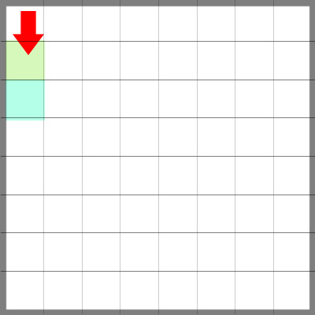

# ProjetoPastilha

Este é um projeto artistico conceitual que mescla técnologia de informação, róbotica e redes sociais.

- Painel
- Impressoras
- Cabecote
- Câmeras
- Controler
- Servidor
- Painel remoto
- Sistema de gereciamento de usuáros

## Conceitos para construção no projeto

- Colaborativo
- Reuso e Reciclagem
- Redução residuos
- *Open Source*

## Conceitos para o uso da técnologia

- Colaborativo
- Sem fins lucrativos
- Acessível

## Descrição

Um grande painel onde uma ou mais, impressoras vetoriais estarão interligadas a um servidor para controle remoto direto. O usuário tera um limite de tempo para efetuar seu desenho, em uma fração da area de cobertura da impressora, como indicado nas areas colordas da imagem a seguir.

A ordem de impressão é vertical como mostra a figura anterior.
